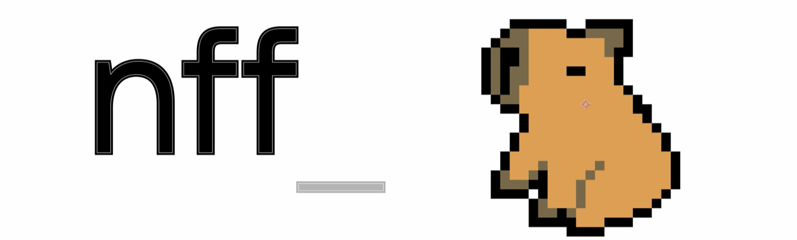
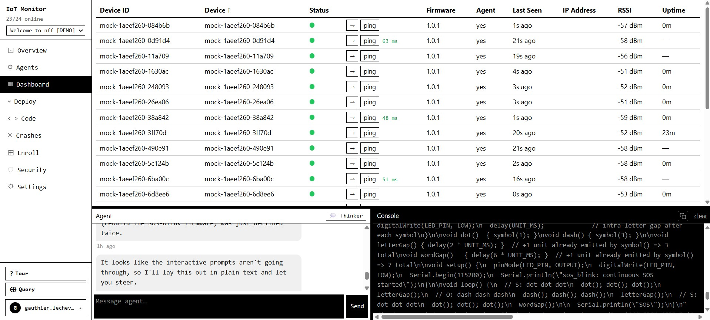

<p align="center">
  
</p>

<h1 align="center">nff — LLM bridge to hardware</h1>

<p align="center">
  <a href="https://pypi.org/project/nff/"></a>
  <a href="LICENSE"></a>
  
  
  
  <a href="https://nanoforgeflow.com"></a>
</p>

nff is an MCP server that gives LLMs direct control over physical hardware — on the bench during development, and in the field for maintenance and diagnosis.

Connect your board over USB and Claude writes, compiles, flashes, and reads serial output autonomously. Deploy devices with the `nff-sdk-c` library and Claude can reach them remotely: capture crash state, diagnose failures, and push fixes — without physical access.

> **nff is the open-source bench CLI of the [nff platform](https://nanoforgeflow.com)** — an end-to-end, agent-driven system for developing, shipping, and operating ESP32-class firmware (bench → OTA → fleet diagnosis). This repo (`nff`) and the device library (`nff-sdk-c`) are the two **MIT-licensed** pieces that run on the engineer's laptop and hardware; the hosted backend (fleet broker, OTA orchestration, crash-analysis engine) is proprietary.

<p align="center">
  
</p>

```
you: "Run the sensor init sequence and assert the calibration values over serial"
LLM: [writes firmware] → [compiles] → [flashes ESP32] → [reads serial] → returns structured output

you: "Why did the unit in the field just hard-fault?"
LLM: [captures panic over OTA] → [reads registers + backtrace] → "Stack overflow in your sensor ISR at line 47"
```

**Supported boards:** with the **PlatformIO backend** (now the default in both the shipped Rust binary and the Python implementation) nff is board-universal — **any of PlatformIO's ~1000+ boards across ~40 hardware platforms** (every ESP32 variant, RP2040/Pico, all STM32 families, classic & megaAVR, SAMD/SAM, Teensy, nRF51/nRF52, Renesas RA / Arduino Uno R4, NXP LPC, Kendryte K210, GD32V/RISC-V, MSP430, TIVA, and many more), with the platform toolchain auto-installed on first build. The classic **arduino-cli backend** remains available and covers ESP32 (CP210x / CH340) · ESP8266 (FTDI) · Arduino AVR (Uno, Mega, Nano, Leonardo). See [Build backends](#build-backends) and the full [Supported Boards](#supported-boards) listing.

**Shipped as a single Rust binary.** The release artifact is the compiled `nff` binary built from `nff-rs/` — a self-contained executable with no Python runtime required. The Python package under `nff/nff/` remains as the reference/prototyping implementation (features are often prototyped there first, then ported to Rust at parity); both are kept in sync, version for version. The Rust port is at full feature parity (CLI commands, MCP server + OAuth proxy, the bench-loop hardening, the PlatformIO build backend, and the `nff pi` Raspberry-Pi probe).

---

## Two modes, one tool

### Bench development
nff closes the edit–compile–flash–debug loop. Instead of switching between your editor, terminal, and serial monitor, you stay in one conversation. The LLM iterates on firmware in response to serial output, catches exceptions, and reflashes — handling the logistics so you focus on the problem.

### Field maintenance
Once a device is deployed, nff becomes your remote window into it. When a bare-metal MCU crashes in the field there is no shell, no SSH, no process table — just a panic on a chip you cannot physically touch. nff captures the crash state (registers, stack, memory, backtrace) and routes it to a cloud AI agent that explains the failure in plain language and drives the recovery. No truck roll. No JTAG probe on-site.

This is the gap Mender, balena, and similar OTA tools cannot fill: they require a living network client running inside the firmware. nff's field mode works precisely when the firmware is dead.

---

## Build backends

nff can drive the build/flash loop through either of two toolchains, selected per-run or persisted in config. Every `compile`/`flash` path resolves the backend the same way, so the CLI and MCP tools are identical regardless of which one is active.

| Backend | Boards | Toolchain | Sketch layout |
|---|---|---|---|
| **`platformio`** (default) | board-universal — any [PlatformIO board id](https://docs.platformio.org/en/latest/boards/index.html) (`esp32dev`, `esp32-s3-devkitc-1`, `pico`, `genericSTM32F103C8`, `uno`, …) | PlatformIO Core; the platform + framework + esptool **auto-install on first build** per board family | native `src/main.cpp` + a generated `platformio.ini` |
| **`arduino`** | the [Supported Boards](#supported-boards) table (FQBN) | arduino-cli + manually installed cores | `.ino` sketch folder |

**Selecting a backend** — precedence is env var → config → default (`platformio`):

```bash
# per-run override (config untouched)
NFF_BUILD_BACKEND=platformio  nff compile sketches/esp32_vitals --board esp32dev
NFF_BUILD_BACKEND=arduino     nff compile sketches/esp32_vitals --board esp32:esp32:esp32

# persist a choice (writes build.backend + build.board to ~/.nff/config.json)
nff init --backend platformio     # → no flags needed afterwards
nff init --backend arduino        # opt back into arduino-cli
```

`--board` is backend-aware: a **PlatformIO board id** under the pio backend, an **arduino-cli FQBN** under the arduino backend. With a board saved via `nff init` you can omit `--board` entirely.

> **Status:** both backends ship in the compiled Rust binary (`nff-rs/`) — the artifact `pip install nff` delivers — with **PlatformIO the default**. The Python package (`nff/`) is the reference/prototyping implementation and is kept at parity. `nff init --backend platformio` (or `arduino`) persists the choice.

📄 Full write-up — architecture, internals, requirements, and verification — in [`docs/platformio-backend.md`](docs/platformio-backend.md).

---

## AI crash diagnosis — validated

Phase-0 validation on an ESP32 confirmed that Claude can produce specific, correct diagnoses from raw panic output alone — no ELF file, no source access:

| Crash type | Panic signature | What Claude identifies |
|---|---|---|
| Null pointer write | `EXCCAUSE 0x1d` + `EXCVADDR 0x00000000` | StoreProhibited in `setup()`, stack intact |
| Stack overflow | `EXCCAUSE 0x01` + repeated PC in backtrace | Unbounded recursion, FreeRTOS canary, depth 11 |
| Watchdog timeout | IDF task-WDT log, no Guru Meditation | `loopTask` on CPU 1 never yielded, liveness failure |

Each failure class produces a different panic format, exception code, backtrace depth, and task snapshot — rich enough signal to distinguish root causes without symbol resolution. With addr2line + the build ELF wired in (next milestone), diagnoses resolve to exact source lines.

---

## MCP Tools

### Bench — hardware & build

| Tool | What it does |
|---|---|
| `list_devices()` | List all connected USB boards |
| `compile(sketch?, code?, board?)` | Compile a sketch **only** (no board/port) to verify it builds; returns JSON `{ok, fqbn, elf, image, artifacts, errors, output}` |
| `flash(sketch?, code?, board?, port?)` | Compile **and** upload a sketch to the connected board |
| `serial_read(duration_ms?, port?, baud?)` | Capture serial output for N ms |
| `serial_write(data, port?, baud?)` | Send a string to the device |
| `reset_device(port?)` | Toggle DTR to hardware-reset the board |
| `get_device_info(port?)` | Return port, board name, FQBN, baud rate |

### Simulation — Wokwi (CI without a bench)

| Tool | What it does |
|---|---|
| `wokwi_flash(code, board?, timeout_ms?)` | Compile and simulate a sketch via Wokwi |
| `wokwi_serial_read(code, board?, duration_ms?)` | Compile, simulate, return serial output |
| `wokwi_get_diagram(board)` | Return a minimal `diagram.json` stub to extend |

### Field — diagnosis & auth

| Tool | What it does |
|---|---|
| `repair(serial_output, build_id?, board?)` | Send serial/crash output to the diagnosis server and return a structured diagnosis |
| `authenticate(email?, password?)` | Log in to the diagnosis server (direct, or omit both for browser OAuth) |
| `complete_authentication(timeout?)` | Wait for a browser login to finish and store the tokens |
| `auth_status()` / `auth_logout()` / `auth_clear()` / `auth_reconnect(email?, password?)` | Inspect, end, force-clear, or re-establish the authenticated MCP session |

All bench tools fall back to the default device in `~/.nff/config.json` when `port` and `board` are omitted.

> **Prefer `sketch=` (a path) over `code=`.** Write the `.ino` file to disk first and pass the sketch path, rather than raw source — it keeps the build artifact lookup deterministic. Use `compile` to check a build with no board attached; use `flash` only when a port is present.

---

## Demo

[](https://youtu.be/xKaqBuO8Gjg)

### Real Hardware

[](https://youtu.be/JoCwczeRfuQ)

### Wokwi Simulation

[](https://youtu.be/FZ70lQ-VP3g)

---

## Quickstart

Get your hardware on the LLM loop in under five minutes.

### 1. Install

```bash
pip install nff
```

`pip install nff` fetches a **prebuilt wheel containing the compiled Rust binary** for your platform (Linux x64, Windows x64, macOS arm64/x64) — no Python runtime and no Rust toolchain needed at runtime. pip is just the delivery mechanism; the installed `nff` command is the native binary.

### 2. Install board cores

On the **default PlatformIO backend** there is nothing to install here — PlatformIO Core is set up by `nff init`, and the platform/framework/esptool for your board auto-install on the first build. Just make sure your sketch names a PlatformIO board id (`--board esp32dev`, etc.).

Only on the **arduino backend** do you install cores manually:

```bash
# arduino backend only — install the cores you need
arduino-cli core install esp32:esp32
arduino-cli core install arduino:avr
arduino-cli core install esp8266:esp8266
```

> Both toolchains (`platformio` / `arduino-cli`) are auto-installed by `nff init`/`nff install-deps` for the active backend if not already present.

### 3. Plug in your board and run init

```bash
nff init
```

This single command:
- **Signs you in** to the nff platform (browser login) — required, because the MCP tools are gated behind your account
- Detects your board by USB vendor/product ID
- Writes `~/.nff/config.json` (default device + build backend/board)
- Installs the active backend's toolchain if missing (PlatformIO Core, or arduino-cli)
- On the arduino backend with an ESP32, optionally enrolls the board on the nff platform (flash bootstrap firmware → claim into your dashboard)
- Registers the nff MCP server with Claude Code (`claude mcp add --scope user --transport http nff http://127.0.0.1:3010/mcp`)
- **Starts the MCP server in the background** so Claude Code finds it already running — no manual `nff mcp` needed

```
  ✓ Signed in to the nff platform
  ✓ Found: ESP32 (CP210x) on COM10
  ✓ Config written to ~/.nff/config.json
  ✓ Registered with Claude Code CLI (HTTP MCP on 127.0.0.1:3010)
  ✓ Server running on http://127.0.0.1:3010/mcp

✓ nff configured! Restart Claude Code to pick up the nff MCP server.
```

> The background server runs until you reboot or stop it. After a reboot, run `nff mcp`
> (or just re-run `nff init`) to bring it back up — `nff doctor` will tell you if it's down.

### 4. Verify

```bash
nff doctor
```

---

## CLI Reference

### Real hardware

| Command | Description |
|---|---|
| `nff init` | Sign in, detect board, write config, register + start the MCP server |
| `nff compile <path>` | Compile a sketch to verify it builds (no board/port needed) |
| `nff flash <path>` | Compile and upload a sketch directory |
| `nff monitor` | Stream serial output (Ctrl+C to exit) |
| `nff connect` | Attach to a device, continuously analyse its logs, autonomously repair detected issues |
| `nff repair` | Send captured serial/crash output to the diagnosis server for a structured root-cause |
| `nff auth login` | Authenticate with the diagnosis server (browser OAuth or email/password) |
| `nff doctor` | Check all dependencies and configuration |
| `nff mcp` | Start the MCP server (streamable HTTP on `127.0.0.1:3010`; started in the background by `nff init`) |

```bash
nff flash sketches/sensor_init
nff flash sketches/sensor_init --board esp32dev --port COM3   # PlatformIO board id (default backend)
nff flash sketches/sensor_init --board esp32:esp32:esp32      # arduino FQBN (NFF_BUILD_BACKEND=arduino)
nff flash sketches/sensor_init --manual-reset                 # for boards without auto-reset
nff monitor --port COM10 --baud 115200
nff monitor --port COM10 --baud 115200 --timeout 15
```

### nff connect — Autonomous log analysis and repair

`nff connect` keeps a live serial connection to your device and routes each batch of output to Claude for analysis. When Claude detects an error, a hang, or a recoverable fault, it rewrites the sketch, recompiles, reflashes, and resumes monitoring — closing the repair loop without manual intervention.

```
nff connect
  ↓ streams serial from device
  ↓ Claude analyses each log window
  ↓ fault detected → sketch rewritten → nff flash → device reset
  ↓ monitoring resumes automatically
```

Useful flags:

| Flag | Default | Description |
|---|---|---|
| `--port PORT` | auto-detect | Serial port to attach to |
| `--baud BAUD` | 115200 | Baud rate |
| `--sketch DIR` | last flashed | Sketch directory to rewrite and reflash on a fix |
| `--window MS` | 2000 | Log window passed to Claude per analysis cycle |
| `--max-cycles N` | unlimited | Stop after N repair attempts |

### Wokwi simulation (CI without a bench)

| Command | Description |
|---|---|
| `nff wokwi init` | Scaffold `wokwi.toml` + `diagram.json` in current directory |
| `nff flash --sim <path>` | Compile sketch and run headless Wokwi simulation |
| `nff wokwi run` | Run simulation, stream serial output to terminal |
| `nff wokwi run --gui` | Open `diagram.json` in VS Code and auto-start visual simulation |
| `nff wokwi run --serial-log FILE` | Save serial output to file |
| `nff wokwi run --timeout MS` | Set simulation timeout (default 5000 ms) |

---

## Supported Boards

**On the default PlatformIO backend, nff is board-universal.** Pass any of PlatformIO's [~1000+ board ids](https://docs.platformio.org/en/latest/boards/index.html) to `--board` and the matching platform toolchain (compiler + framework + uploader) installs itself on first build — there is no fixed allow-list and nothing to pre-install.

### Architectures & platforms covered

The PlatformIO backend gives nff every PlatformIO **development platform** — each one a whole family of boards. You don't need any of these in nff's catalog; just pass the PlatformIO board id to `--board` and the toolchain installs on first build. The table below is the full set of platforms (≈40), each spanning dozens-to-hundreds of individual boards.

| Platform (`--board` resolves it) | Core / MCU family | Example boards & `--board` ids |
|---|---|---|
| `espressif32` | Espressif ESP32 (Xtensa LX6/LX7 + RISC-V) | ESP32, ESP32-S2, ESP32-S3, ESP32-C3/C6/H2, ESP32-P4 — `esp32dev`, `esp32-s3-devkitc-1`, `esp32-c6-devkitc-1` |
| `espressif8266` | Espressif ESP8266 (Tensilica L106) | NodeMCU, Wemos D1 — `esp01_1m`, `nodemcuv2`, `d1_mini` |
| `raspberrypi` | Raspberry Pi RP2040 / RP2350 (ARM Cortex-M0+/M33) | Pico, Pico W, Pico 2 — `pico`, `rpipicow`, `rpipico2` |
| `atmelavr` | Classic 8-bit Atmel AVR | Arduino Uno/Mega/Nano/Leonardo, Pro Mini — `uno`, `megaatmega2560`, `nanoatmega328`, `leonardo` |
| `atmelmegaavr` | Atmel megaAVR (0-series) | Arduino Uno WiFi Rev2, Nano Every — `uno_wifi_rev2`, `nano_every` |
| `atmelsam` | Atmel SAM (ARM Cortex-M0+/M3/M4) | Arduino Zero/MKR/Due, Adafruit Feather M0/M4 — `mkrwifi1010`, `adafruit_feather_m4`, `due` |
| `ststm32` | ST STM32 (ARM Cortex-M0/0+/M3/M4/M7) — F0/F1/F2/F3/F4/F7/G0/G4/H7/L0/L1/L4/L5/U5/WB/WL | Blue Pill, Black Pill, every Nucleo/Discovery — `bluepill_f103c8`, `genericSTM32F103C8`, `nucleo_f401re`, `nucleo_h743zi` |
| `ststm8` | ST STM8 (8-bit) | STM8S Discovery, sduino — `stm8sdiscovery` |
| `teensy` | PJRC Teensy (ARM Cortex-M4/M7) | Teensy 3.x / 4.0 / 4.1 / LC — `teensy41`, `teensy40`, `teensy36`, `teensylc` |
| `nordicnrf52` | Nordic nRF52 (ARM Cortex-M4, BLE) | Adafruit Feather/ItsyBitsy nRF52840, Nano 33 BLE — `nano33ble`, `adafruit_feather_nrf52840` |
| `nordicnrf51` | Nordic nRF51 (ARM Cortex-M0, BLE) | micro:bit v1, BBC boards — `bbcmicrobit`, `nrf51_dk` |
| `renesas-ra` | Renesas RA4M1 (ARM Cortex-M4) | **Arduino Uno R4** Minima / WiFi — `uno_r4_minima`, `uno_r4_wifi` |
| `nxplpc` | NXP LPC (ARM Cortex-M0/M3/M4) | mbed LPC1768, LPC11U24 — `lpc1768`, `lpc11u35` |
| `nxpimxrt` | NXP i.MX RT (ARM Cortex-M7) | MIMXRT1060/1010 EVK — `mimxrt1060_evk` |
| `freescalekinetis` | NXP/Freescale Kinetis (ARM Cortex-M0+/M4) | FRDM-K64F, FRDM-KL25Z — `frdm_k64f`, `frdm_kl25z` |
| `siliconlabsefm32` | Silicon Labs EFM32 (ARM Cortex-M) | EFM32 Giant/Wonder Gecko — `efm32gg_stk3700` |
| `gd32v` | GigaDevice GD32V (RISC-V) | Sipeed Longan Nano — `sipeed-longan-nano` |
| `kendryte210` | Kendryte K210 (RISC-V, AI) | Sipeed MAIX — `sipeed-maix-bit` |
| `microchippic32` | Microchip PIC32 (MIPS) | chipKIT Uno32, Max32 — `chipkit_uno32`, `chipkit_max32` |
| `timsp430` | TI MSP430 (16-bit) | MSP430 LaunchPads — `lpmsp430g2553`, `lpmsp430fr6989` |
| `titiva` | TI TIVA C (ARM Cortex-M4) | Tiva C / Stellaris LaunchPad — `lptm4c1230c3pm`, `lplm4f120h5qr` |
| `infineonxmc` | Infineon XMC (ARM Cortex-M) | XMC2Go, XMC1100 Boot Kit — `xmc1100_xmc2go` |
| `intel_arc32` | Intel Curie (ARC) | Arduino/Genuino 101 — `genuino101` |
| `wiznet7500` | WIZnet W7500 (ARM Cortex-M0, Ethernet) | WIZwiki-W7500 — `wizwiki_w7500` |
| `lattice_ice40` | Lattice iCE40 FPGA | TinyFPGA B2, iCEstick — `icezum`, `tinyfpga_b2` |

> Less common platforms PlatformIO also ships (and that nff therefore drives) include `nuclei`, `riscv_gap`, `samd21`, `chipsalliance`, `aceinna_imu`, `shakti`, `samsung_artik`, and others — see the [PlatformIO platforms index](https://docs.platformio.org/en/latest/platforms/index.html) for the live, complete list.

### Curated families (built-in catalog)

These are the board ids in nff's built-in catalog. The catalog only supplies sensible defaults (PlatformIO platform + Wokwi sim chip) so you can name a short board id and `nff init` can auto-detect — **every other board above still builds**, you just pass the full PlatformIO id.

| Family | PlatformIO platform | Catalogued `--board` ids | Wokwi sim |
|---|---|---|---|
| **ESP32** | `espressif32` | `esp32dev`, `esp32-s3-devkitc-1`, `esp32-c3-devkitm-1`, `esp32-c6-devkitc-1`, `esp32-s2-saola-1` | ✅ (S2: ❌) |
| **ESP8266** | `espressif8266` | `esp01_1m`, `nodemcuv2` | ✅ |
| **RP2040 / Pico** | `raspberrypi` | `pico`, `rpipicow` | ✅ |
| **STM32** | `ststm32` | `genericSTM32F103C8`, `bluepill_f103c8`, `nucleo_f401re` | ❌ |
| **Classic AVR** | `atmelavr` | `uno`, `megaatmega2560`, `nanoatmega328`, `leonardo` | ✅ |

Need a board that isn't catalogued (Teensy, SAMD, nRF52, Uno R4, ESP32-P4, …)? Just give its PlatformIO id — e.g. `nff compile sketch.ino --board teensy41`. Adding it to the catalog (for auto-detect + a short default) is a [two-line PR](CONTRIBUTING.md#adding-a-new-board).

### USB auto-detect

When you plug a board in, nff resolves it by USB vendor/product ID to a default board id for **both** backends, so `nff init` and `--board`-less commands "just work". A USB-serial chip (CP210x/CH340/FTDI) is shared by many boards, so this is a *default* you can override with `--board`.

| Board | Vendor ID | Product ID | FQBN (arduino) | PlatformIO board id |
|---|---|---|---|---|
| ESP32 (CP210x) | 10c4 | ea60 | `esp32:esp32:esp32` | `esp32dev` |
| ESP32 (CH340) | 1a86 | 7523 | `esp32:esp32:esp32` | `esp32dev` |
| ESP8266 (FTDI) | 0403 | 6001 | `esp8266:esp8266:generic` | `esp01_1m` |
| Arduino Uno | 2341 | 0043 | `arduino:avr:uno` | `uno` |
| Arduino Mega 2560 | 2341 | 0010 | `arduino:avr:mega` | `megaatmega2560` |
| Arduino Leonardo | 2341 | 0036 | `arduino:avr:leonardo` | `leonardo` |
| Arduino Nano | 2341 | 0058 | `arduino:avr:nano` | `nanoatmega328` |

> The **arduino backend** (`NFF_BUILD_BACKEND=arduino`) is limited to the FQBN column above plus whatever cores you `arduino-cli core install`. The PlatformIO backend is the one that makes the rest of the families above available.

---

## Config File

`~/.nff/config.json`, written by `nff init` and editable by hand:

```json
{
  "version": "1",
  "default_device": {
    "port": "COM10",
    "board": "ESP32 (CP210x)",
    "fqbn": "esp32:esp32:esp32",
    "baud": 115200
  },
  "build": {
    "backend": "platformio",
    "board": "esp32dev"
  },
  "wokwi": {
    "api_token": "YOUR_TOKEN",
    "default_timeout_ms": 5000,
    "diagram_path": null
  }
}
```

`build.backend` selects the toolchain (`platformio` default, or `arduino`) and `build.board` holds the PlatformIO board id; the arduino backend uses `default_device.fqbn` instead. The `NFF_BUILD_BACKEND` env var overrides `build.backend` per-run. The Wokwi token can also be set via `WOKWI_CLI_TOKEN` (takes precedence over config).

---

## Claude Code Skills

nff ships Claude Code skills bundled inside the package:

| Skill | When to use |
|---|---|
| `/nff` | Full pipeline reference — hardware and simulation workflows, sketch-first rules, debugging checklist |
| `/wokwi-diagram` | `diagram.json` authoring reference — component types, pin names, wiring patterns |

```
/nff
/wokwi-diagram
```

Skill files live at `nff/skills/` (the source of truth — edit them there) so they ship with every `pip install nff`, and are also mirrored in `.claude/commands/` for project-level use. Copy them into `~/.claude/commands/` to make the slash commands available globally.

---

## Repository Structure

```
nff/
├── nff/                         # Python package — the LIVE implementation
│   ├── cli.py                   # Click CLI — wires every subcommand
│   ├── config.py                # ~/.nff/config.json read/write
│   ├── mcp_server.py            # streamable-HTTP MCP server (Bearer-authed /mcp)
│   ├── commands/
│   │   ├── init.py
│   │   ├── compile_cmd.py       # port-free build check
│   │   ├── flash.py
│   │   ├── monitor.py
│   │   ├── connect.py           # autonomous log-analysis + repair loop
│   │   ├── repair.py            # route crash output to the diagnosis server
│   │   ├── auth_cmd.py          # nff auth login / status / logout
│   │   ├── ota.py
│   │   ├── provision.py
│   │   ├── doctor.py
│   │   ├── clean.py
│   │   ├── install_deps.py
│   │   ├── mcp_cmd.py
│   │   └── wokwi_cmd.py
│   ├── tools/
│   │   ├── boards.py            # USB ID detection + PlatformIO board catalog
│   │   ├── serial.py            # serial read/write/stream/reset
│   │   ├── toolchain.py         # backend dispatcher + arduino-cli/esptool wrappers
│   │   ├── backends/
│   │   │   └── platformio.py    # PlatformIO backend (project scaffold, pio run)
│   │   ├── installer.py         # arduino-cli auto-install
│   │   ├── auth.py              # diagnosis-server token handling
│   │   └── wokwi.py             # Wokwi runner + diagram generation
│   └── skills/                  # /nff + /wokwi-diagram skills (ship with the package)
├── nff-rs/                      # Rust port — the shipped binary (full parity)
├── sketches/
│   ├── blink_esp32/
│   └── servo_button/
├── diagram.json                 # Wokwi circuit schematic
├── wokwi.toml
└── .claude/
    └── commands/
        ├── nff.md               # /nff Claude Code skill
        └── wokwi-diagram.md     # /wokwi-diagram Claude Code skill
```

The Rust crate under `nff-rs/nff/` is the **shipped binary** and is at full feature parity with the Python package — every CLI command and MCP tool runs natively (no Python runtime). Build it with `cargo build --release` (binary at `nff-rs/target/release/nff`). The Python package under `nff/nff/` is the reference/prototyping implementation and is kept in sync version-for-version; when you add a feature, land it in both so the two never drift.

---

## Linux: Serial Port Permissions

```bash
sudo usermod -aG dialout $USER
# then log out and back in
```

`nff doctor` detects this and prints the fix.

---

## License

MIT — see [LICENSE](LICENSE).  
Copyright (c) 2026 Gauthier Lechevalier
